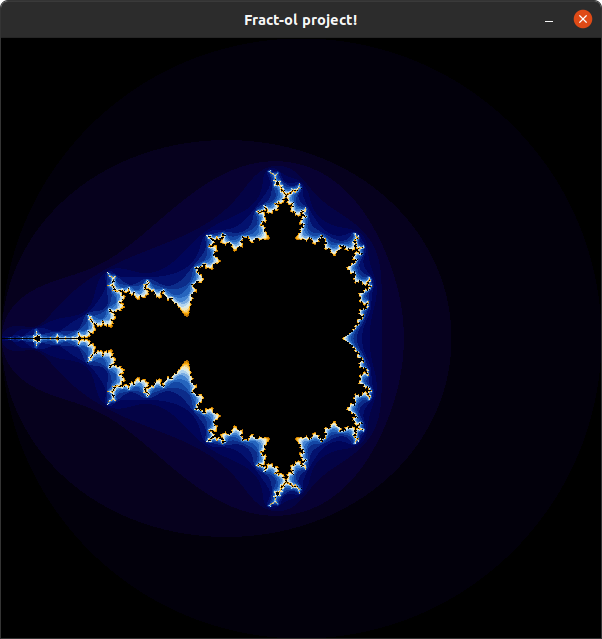

# Fract-ol

## How to create the program?

This version is made for running only in `MACOS`. Several changes has to be done to run on Linux.
You can simply run `make` in order to create the executable `fractol`

## How to run the program?

You can run a list of fractals using the sintax `./fractol [name]`
The program accepts the following commands:

```
	./fractol mandelbrot
	./fractol julia
	./fractol burningship
	./fractol perpendicular_burningship
	./fractol mandelbar
	./fractol celtic_mandelbar
	./fractol celtic_perpendicular
	./fractol perpendicular_buffalo
```
Another input different of those should print this exact list in the terminal and quit appropriately


## Controls

After the fractal is displayed, you can use several keys to interact with it:

* `ARROWS / WASD: MOVE` Translate your image.
* `M: MENU` Toggle menu on/off
* `L: LOCK MOUSE` Lock/unlock mouse coordinates to control Julia Set Parameters
* `C: COLORS` Change color palettes
* `F: FRACTALS` Change fractal algorithm
* `R: RESET` Reset all parameters to default values
* `+/-: ITERATIONS` Increase/Descrease iteration limit of algorithm
* `MW: ZOOM` Mouse Wheel controls the zoom (following its position)
* `M1: JULIA PARAMS` Click with mouse left bottom to set Julia Set Parameters (when `LOCK MOUSE` is off)
* `P: PSYCHEDELIC` Toggle Psychedelic mode [maybe too much]
* `SHIFT: SHIFT COLOR` Shift colors forward
* `Z: MOUSE ITER` Zoom of mouse also increase/decrease iterations by 1. Perfect to give feeling of infinity zoom. Better if using `WINDOW_SIZE` less than 300.
* `ESC: QUIT` Quit program appropriately.

## Samples

### Mandelbrot


### Julia


### Burningship


### Perpendicular Burningship


### Mandelbar


### Celtic Mandelbar


### Celtic Perpendicular


### Perpendicular Buffalo


### Mandelbrot with menu and psychedelics on


### Julia with other parameters and colors


### Another burninship with psychedelic colors
